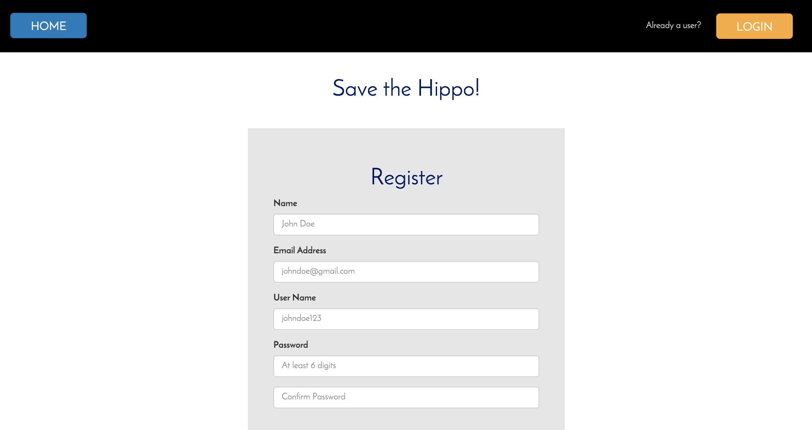
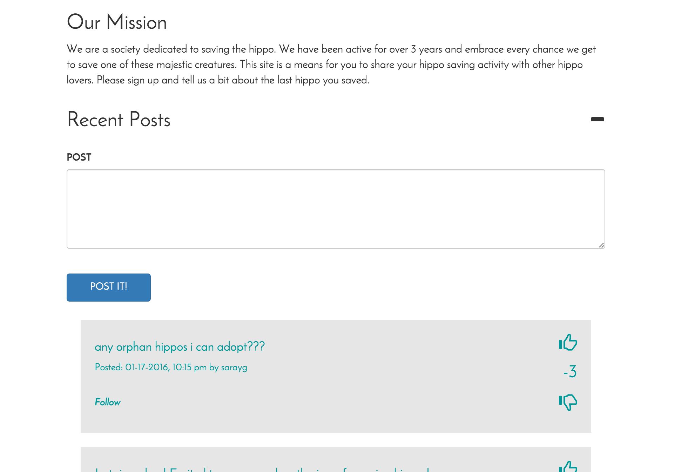
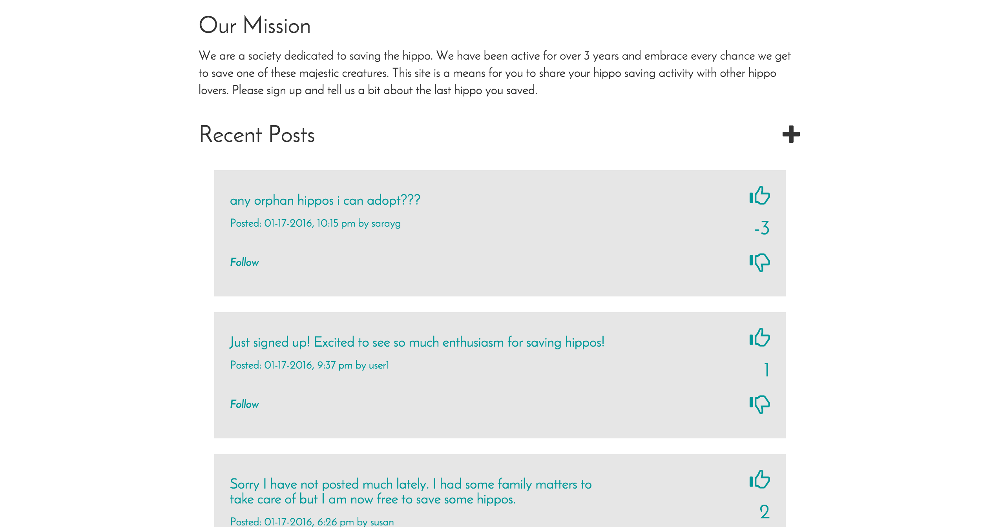

# Protect the Hippos - YikYak clone in PHP and MySQL

This is a site that is meant to mimic the functionality of YikYak. It allows a user to register and it will save their information into a MySQL database. Once a user registers or logs in they can make posts and up or down vote posts. They can also choose to follow other users if they see a post that catches their eye. The main page features the 20 most recent posts and below that it has the 20 most recent posts of people you follow. The site is built with PHP, MySQL, JavaScript, and jQuery.

